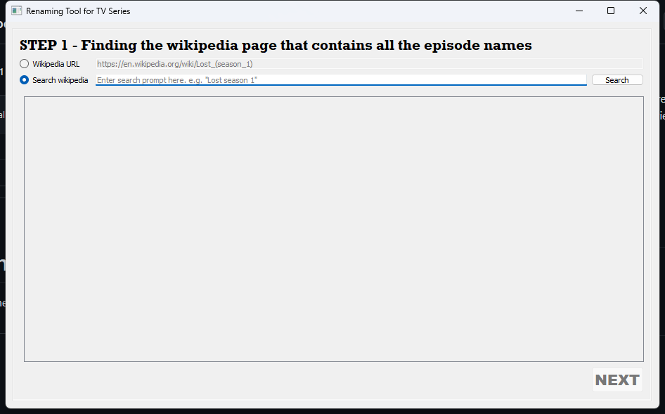

# renaming-tool
A rather quite helpful renaming tool for batch renaming TV series episodes.

# Preview

This is the initial GUI that you'll see once you load the program.

Enter the wikipedia page that belongs to TV series season, or the whole TV Series page if there's no season-specific pages.

Upon clicking NEXT, all episodes will automatically be fetched from the wikipedia page, which all of them are fully customizable and formattable.

You can also apply mathmatical calculations to the episode number and season number in the formatting.

Can also insert or remove episodes by clicking ADD or REMOVE. This is typically common for 2-part episodes where on the wikipedia page it only counts as one cell.

Once happy with the format, enter the folder location which contains all the episodes.

You may choose to skip files and have them not be renamed. There are 2 modes to skipping a file, this can be toggled by simply tapping the checkbox 2 times. It has a total of 3 states.

One mode is where the skipped file will completely be skipped. Meaning it won't "digest" an episode number. 
The other mode is where the skipped file will be skipped, but it still counts as an episode. Meaning it will "digest" an episode number, however still not be renamed.

